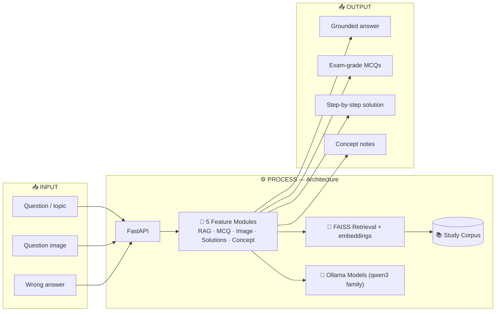

<h1 align="center">🎓 RAG-Assistant [RIZEE Platform]</h1>

<p align="center">
  <b>Intelligent tutoring backend for Indian competitive-exam students (JEE Main · JEE Advanced · NEET)</b><br/>
  Five AI-driven features — RAG Q&A, MCQ generation, image-to-solution, text solutions, and a concept tutor —<br/>
  all running locally via Ollama, served behind FastAPI.
</p>

<p align="center">
  
  
  
  
  
  
</p>

---

## 📖 Overview

The **RIZEE AI Tutor** is a FastAPI backend powering an intelligent tutoring system. It bundles five AI features, all running **locally via Ollama** (no external API calls):

| # | Feature | Module |
|---|---|---|
| 1 | **RAG-powered Q&A** — answers from a private study-material corpus | `rag_core.py` |
| 2 | **MCQ Generation** — exam-grade questions calibrated to JEE/NEET | `similarquestions_core.py` |
| 3 | **Image-to-Solution** — extracts & solves a question from a photo | `Image_explain.py` |
| 4 | **Text Solutions** — short or detailed step-by-step answers | `solutions_core.py` |
| 5 | **Concept Tutor** — explains the concept & traps behind a wrong answer | `summary_core.py` |

---

## 🏗️ Architecture



All five features sit behind one FastAPI service. The RAG feature grounds answers in a FAISS-indexed study corpus, while every feature streams responses from locally hosted Ollama models.

---

## 🔎 Feature 1 — RAG Question Answering (`rag_core.py`)

A full **Retrieval-Augmented Generation** pipeline:

- Embeds the corpus with `sentence-transformers/all-MiniLM-L6-v2`
- Stores embeddings in **per-group FAISS `IndexFlatL2`** indexes, segmented by `{source_type}_{class}_{subject}` (e.g. `materials_10_physics`)
- At query time, picks the right group index by class + subject, retrieves top-4 passages, and streams the answer token-by-token via `ollama.chat(stream=True)`

| Behaviour | Detail |
|---|---|
| **Query routing** | Keywords like `"question paper"`, `"jee questions"` → `questions_` group; else `materials_` |
| **Query-type detection** | `"explain" / "derive" / "how" / "why"` → detailed 8-section answer; else short 3–8 sentences |
| **Multi-part decomposition** | Numbered sub-parts / connectives split via `decompose_question()`, answered separately |
| **Context fallback** | If retrieved context doesn't help, silently re-answers from model knowledge |
| **Continue / expand** | `/continue` searches all groups, merges & re-ranks by L2, dedups, extends prior answer |
| **Mermaid flowcharts** | Explicit flowchart requests trigger a second LLM call producing fenced ` ```mermaid ``` ` |
| **Query logging** | One JSON line per query → `logs/query_logs.jsonl` (timestamp, hash, duration) |

**Endpoints:** `POST /askmodel` · `/contextanswer` · `/generalanswer` · `/continue` · `/decomposition` · `/flowchart` · `GET /health`

---

## 📝 Feature 2 — MCQ Generation (`similarquestions_core.py`)

Exam-grade MCQs calibrated to **JEE Main (Easy/Medium)** and **JEE Advanced (Hard)**, with strict format enforcement and MathML math.

**Pipeline:** intent detection → sub-topic extraction → strict prompt construction → generate-with-retry → hard-mode rewrite → cleanup → stream in 800-char chunks.

| Level | Target | Key rules |
|---|---|---|
| **Easy** | JEE Main lower | single formula, 1-step, clean integers |
| **Medium** | JEE Main upper | 1–2 reasoning steps, up to 2 concepts |
| **Hard** | JEE Advanced | ALL of: tricky limits + algebraic complexity + conceptual trap; ≥3 steps |

`distribute_counts()` splits totals across difficulties; `/get-similar-questions-3` serializes via `SEM_MCQ = Semaphore(1)`.

**Endpoints:** `GET /get-similar-questions-3` · `POST /generatemcqs` · `GET /explain-mcq-3` · `GET /explain-mcq-detailed-3`

---

## 🖼️ Feature 3 — Image-to-Solution (`Image_explain.py`)

Two-stage pipeline:

1. **Vision OCR** — `qwen3-vl:2b` extracts question text (separates multiples with `===QUESTION===`, marks unreadable as `[?]`, never solves).
2. **Text solver** — `qwen3:8b` produces a detailed 8-section MathML solution.

`/process-image-question` runs stage 1 under `SEM_IMAGE_VL (1)` (150s) and stage 2 under `SEM_INTERACTIVE (4)` (120s).

---

## 🧮 Feature 4 — Text Solutions (`solutions_core.py`)

- **Short** (`POST /api/solutions/short_explaination`) — compact coaching style, MathML math
- **Detailed** (`POST /api/solutions/detailed_explaination`) — full 8-section structure

Both strip `<think>` blocks and conversational preamble before returning.

---

## 💡 Feature 5 — Concept Tutor (`summary_core.py`)

Given wrong questions (separated by `---`), produces teacher-style corrective notes per question.

- **Subject detection** — keyword scoring across Physics / Chemistry / Maths / Biology
- **Subject-specific prompts** — 4-section output: `🟦 Final Answer` · `🟦 Solution` · `🟦 Concept` · `🟦 Traps`
- **CLI invocation** — runs `qwen3:32b` via `subprocess.Popen(["ollama","run",...])` (300s timeout) — intentional, since `qwen3:32b` is too large for the Python library's default memory handling here

**Endpoint:** `POST /api/summary/generate`

---

## 🧩 Architecture Notes

| Concern | Detail |
|---|---|
| **Two server files** | `main.py` (CORS, API-only) · `app.py` (static UIs at `/`, no CORS). Apply API changes to both. |
| **Concurrency guards** | `SEM_INTERACTIVE (4)` · `SEM_MCQ (1)` · `SEM_IMAGE_VL (1)` prevent GPU/memory overload |
| **Sync→async bridge** | `stream_sync_gen()` runs blocking generators on a daemon thread, piping tokens through an `asyncio.Queue` |
| **Math rendering** | MathML everywhere; `convert_latex_blocks_to_mathml()` converts `$…$`, `$$…$$`, `\[…\]`, forced `display="inline"` |
| **Thinking-leak protection** | `<think>…</think>` stripped (streaming state machine + `_strip_thinking_tags()` regex) |
| **Flexible parsing** | Endpoints accept `question` / `query` / `text` / `input`, raw JSON string, or `?question=` |

---

## 🚀 Getting Started

```bash
# API-only (CORS) — for mobile/cross-origin clients
uvicorn main:app --reload

# With bundled static HTML UI served at /
uvicorn app:app --reload
```

Docs → `http://localhost:8000/docs` · Health → `GET /health`

**Standalone Streamlit apps:**
```bash
streamlit run similarquestions_core.py   # MCQ generator
streamlit run solutions_core.py          # Solutions
streamlit run summary_core.py            # Concept tutor
streamlit run Image_explain.py           # Image solver
```

---

## 📋 Prerequisites

**Ollama running** with:

| Model | Used by |
|---|---|
| `qwen3:8b` | RAG, MCQ, solutions, image solving |
| `qwen3:32b` | Concept tutor |
| `qwen3-vl:2b` | Vision OCR |

**RAG corpus** at `/app/Nithish/ALL_RAG_Input/`:
- `DBQuestions_input/**/*.json` — question bank (`topic`, `exam` fields)
- `Materials_input/**/*.json` — study materials (`text`/`content`/`chunk` fields)

> The FAISS index builds on first startup and caches to `faiss_index.bin`. Delete the `.bin` to force a rebuild when the corpus changes.

---

## 🧰 Tech Stack

| Layer | Technologies |
|---|---|
| **API** | FastAPI · Uvicorn · Streamlit (standalone UIs) |
| **LLMs** | Ollama — `qwen3:8b`, `qwen3:32b`, `qwen3-vl:2b` |
| **Retrieval** | FAISS (`IndexFlatL2`) · `all-MiniLM-L6-v2` |
| **Rendering** | MathML · Mermaid |

---

<p align="center">
  <a href="https://www.linkedin.com/in/abbunitheesreddy/"></a>
  <a href="https://github.com/AbbuNitheesReddy"></a>
  <a href="mailto:nithish.7098@gmail.com"></a>
</p>
<p align="center"><i>Built by Abbu Nithees Reddy</i></p>
